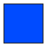
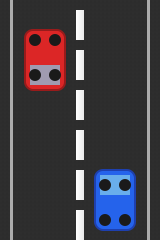
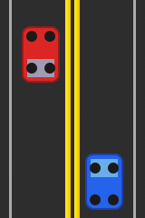
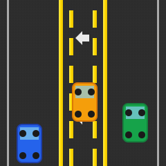
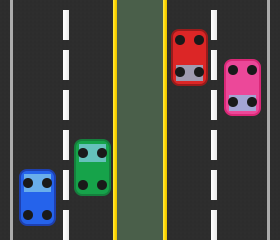
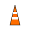

# Signs, Signals & Markings (Chapter 3)

!!! abstract "TL;DR"
    Read shape + color first to infer intent, then confirm with text/symbol. Pavement lines govern where you may travel or pass—solid means hold, broken allows change when safe.

## Scope

Shapes, colors, and pavement markings that communicate regulatory, warning, and guidance information. Verify color or marking specifics (e.g., lane line meanings) in official guide.

## Learning Objectives

- Interpret sign shape & color at a glance.
- Distinguish regulatory vs warning vs guide signage.
- Apply pavement marking meanings to lane positioning & passing.
- Recognize signal indications & lane control arrows.

## 1. Sign Shape

Shape signals intent before text. Catalog:

| Shape | Icon | Meaning |
|-------|------|---------|
| Octagon |  | Stop |
| Triangle (down) |  | Yield |
| Diamond |  | Warning / hazard ahead |
| Rectangle (vertical) |  | Regulatory |
| Rectangle (horizontal) |  | Guide / info |
| Pentagon |  | School zone / crossing |
| Circle |  | Railroad advance |
| Crossbuck |  | Railroad crossing |
| Pennant |  | No passing zone |

## 2. Sign Colors

Color sets tone (prohibit vs warn vs guide). Catalog:

| Color | Swatch | General Meaning | Typical Examples |
|-------|--------|-----------------|------------------|
| Red |  | Stop / Yield / Prohibited | STOP, DO NOT ENTER, WRONG WAY |
| Yellow |  | General Warning | Curve ahead, Merge area |
| Orange |  | Temporary Work Zone | Road work ahead, Detour |
| Black |  | Regulatory (text/symbol) | Speed numerals, lane control text |
| White |  | Regulatory background | Speed limit, One Way |
| Fluorescent Yellow-Green |  | School / Ped / Bike emphasis | School crossing, Pedestrian ahead |
| Green |  | Direction / Guidance | Exit signs, mileage/distance |
| Brown |  | Recreation / Cultural | Park entrance, Historic site |
| Blue |  | Motorist Services | Gas, Food, Hospital |

## 3. Pavement Markings

| Marking | Icon | Meaning | Driver Action |
|---------|------|---------|---------------|
| Solid Center Line |  | Separates opposing traffic; no passing where solid on your side | Stay in lane; do not initiate pass |
| Broken Center Line |  | Passing permitted when clear | Signal, check gap, pass safely |
| Double Solid Yellow |  | No passing either direction | Do not cross except turning left into/ out of driveway |
| White Lane Line (Same Direction) |  | Separates lanes moving same direction | Solid = hold lane; broken = may change when safe |
| Lane Arrow |  | Permitted turn / movement from lane | Commit to shown movement; position early |
| Crosswalk |  | Pedestrian crossing zone | Yield to pedestrians; stop before markings |
| Stop Line |  | Legal stopping point at sign/signal | Stop before line; then proceed when allowed |
| Center Left-Turn Lane (3-lane) |  | Shared lane for left turns from either direction; marked with double broken yellow and arrows | May use to turn left; yield to oncoming traffic; don't use for through travel |
| Divided Highway (4-lane) |  | Physical median separates opposing directions; typically higher speed limit | Stay in proper direction lanes; no crossing median; obey posted speed |

## 4. Signals & Lane Control

| Indication | Icon | Meaning | Driver Action |
|------------|------|---------|---------------|
| Steady Red |  | Stop | Full stop; turn right on red only if permitted |
| Steady Yellow |  | Transition (about to change to red) | Prepare to stop if safe; clear intersection if already in |
| Steady Green |  | Proceed | Go if intersection clear; yield to pedestrians/turning conflicts |
| Flashing Red |  | All-way stop | Treat as stop sign; yield to traffic that arrived first |
| Flashing Yellow |  | Caution; slower speed | Cover brake; proceed carefully |

| Lane Control | Icon | Meaning | Action |
|-------------|------|---------|--------|
| Green Arrow | → | Lane open for movement shown | Use lane for indicated movement |
| Red X | ✕ | Lane closed | Do not use lane; merge away |
| Yellow Arrow / X | ! | Transition (soon to change) | Prepare to vacate lane safely |

### Left-Turn Signal Types Evolution

Modern flashing yellow arrow (FYA) heads replace traditional "doghouse" clusters. They give a clearer distinction between protected (green arrow) and permissive (flashing yellow arrow) phases and reduce driver confusion with circular greens.

| Type | Icon | Phases Provided | Notes |
|------|------|-----------------|-------|
| Traditional Doghouse 5-Section |  | • Red (stop) • Green circle + Green arrow (protected left) • Yellow circle + Yellow arrow (clearance) • Green circle (permissive left, yield to oncoming) • Yellow circle (clearance) | Left turn only; typically has sign "Green Ball Yield to Oncoming Traffic" |
| Vertical 5-Head Protected/Permissive |  | • Red (stop) • Red + Green arrow (protected left) • Red + Yellow arrow (clearance) • Green circle (permissive left + through) • Yellow circle (clearance) | Saves lateral space; still uses circular permissive green |
| 4-Section FYA Arrow Head |  | • Red arrow (stop) • Green arrow (protected left) • Steady yellow arrow (clearance) • Flashing yellow arrow (permissive left) | Distinct flashing arrow conveys yield to opposing traffic |
| 3-Section FYA Arrow Head |  | • Red arrow (stop) • Green arrow (protected left) • Flashing yellow arrow (permissive left) | Combines clearance into transition flash timing; used where simpler sequencing sufficient |
| Protected-Only 3-Head |  | • Red arrow (stop) • Green arrow (protected left) • Yellow arrow (clearance) | All arrows; never yield on flashing yellow because none provided |

Phase logic summary:

- Green Arrow: Protected turn; opposing and pedestrian conflicts held.
- Flashing Yellow Arrow: Permissive turn; yield to opposing traffic & pedestrians, then complete turn when gap exists.
- Steady Yellow Arrow: Prepare to stop; protected phase ending.
- Red Arrow: Stop—no turn allowed.

## 5. Work Zones & Temporary Control

| Element | Icon | Purpose | Driver Action |
|---------|------|---------|---------------|
| Cone |  | Channelizes traffic; indicates taper | Reduce speed; stay within designated path |
| Orange Diamond Sign |  | Warns of work zone condition | Read message early; adjust speed/position |
| Arrow Board |  | Directs merge or lane shift | Merge promptly and smoothly |
| Flagger / Paddle |  | Provides hand/paddle control | Obey flagger instructions immediately |
| Barrier |  | Separates workers and traffic | Do not drive behind barriers; maintain buffer |

Slow early, increase following distance, and expect sudden stops or workers close to the lane edge.

<!-- Combined visual removed; replaced by per-item tables to reduce cognitive load and silence MD033 inline HTML warnings. -->

## Quick Self-Check

- What does a pentagon shape suggest?
- Difference between solid and broken white lane lines?
- Meaning of a flashing yellow signal?

Proceed to quiz when confident.

## 3 things to remember

- Shape + color are fast clues (e.g., octagon = stop; yellow = warning).
- Lane lines: solid = maintain lane; broken = lane change or passing when safe.
- Flashing red = stop; flashing yellow = caution.

---

## Quick Flashcards

## Quick Review

What does an octagon sign mean?

Stop.

What does a solid yellow center line indicate?

Do not pass where it is solid on your side.

Flashing red vs flashing yellow?

Flashing red means stop; flashing yellow means caution.

