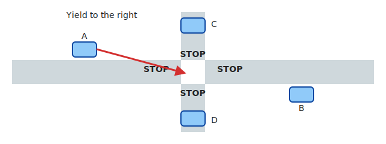
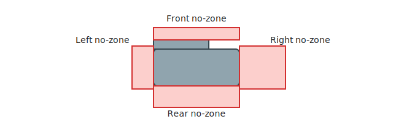
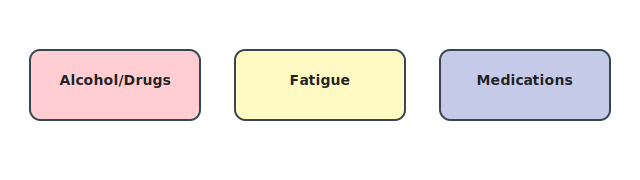
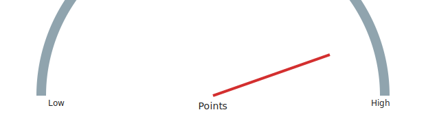

# Outline (Chapter-Aligned)

Below is the chapter-aligned structure based on the official Missouri Driver Guide. Each chapter includes an overview page and an interactive quiz.

## Chapter 1 – The Missouri Driver License
- Licensing stages (GDL)
- Identification & documents
- Renewal & responsibilities

## Chapter 2 – The Driver Exam
- Vision, knowledge, road test purposes
- Readiness & common failure causes
- Retest considerations (verify official intervals)

## Chapter 3 – Pavement Markings, Traffic Signs, Lights & Signals
- Sign shapes/colors/categories
- Pavement line meanings & special markings
- Signal phases & lane control indicators

## Chapter 4 – Rules of the Road
- Right-of-way principles
- Lane use & following distance
- Speed law concepts

## Chapter 5 – Parking
- Prohibited locations (verify distances)
- Hill & parallel parking procedures
- Safety and visibility

## Chapter 6 – Highway Driving
- Merging & ramp strategy
- Lane discipline & passing
- Space management at higher speeds

## Chapter 7 – Sharing The Road
- Vulnerable users: pedestrians, bicycles, motorcycles
- School bus stop procedures
- Large truck limitations

## Chapter 8 – Safe Driving Tips For Everyday Driving
- Scanning & signaling discipline
- Courtesy & space cushions
- Hazard anticipation

## Chapter 9 – Safe Driving Tips for Special Driving Conditions
- Night, rain, fog adaptation
- Snow/ice traction strategies
- Skid recovery basics

## Chapter 10 – Be in Shape to Drive
- Alcohol/drug impairment
- Fatigue & emotional state
- Medication and distraction interplay

## Chapter 11 – The Point System and How It Affects You
- Point accumulation & thresholds
- Administrative actions
- Prevention strategies

## Chapter 12 – Vehicle Titling and Registration
- Titling versus registration
- Renewal & transfer basics
- Consequences of lapses

## Chapter 13 – Mandatory Insurance
- Minimum liability concept
- Proof of insurance formats
- Penalties for non-compliance

## Chapter 14 – Safety & Emissions Inspections and Required Equipment
- Required safety equipment
- Inspection purpose
- Failure indicators

## Chapter 16 – Distracted Driving and Electronic Communication Devices
- Distraction types
- Device usage limits
- Mitigation strategies

---

## Practice Exams

After completing all chapters, test your comprehensive knowledge with three full-length practice exams:

- **Practice Exam 1** – 25 questions covering all topics
- **Practice Exam 2** – 25 questions with different scenarios
- **Practice Exam 3** – 25 questions for thorough preparation

Each practice exam simulates the actual Missouri Class F knowledge test. You need **20 correct answers out of 25 questions** to pass (80%).

---

**Note:** Commercial Vehicles (Chapter 15) intentionally excluded from Class F study scope.

## Visual overview

  <figure style="margin:0;">
    
    <figcaption style="text-align:center;font-size:0.75rem;">Signs</figcaption>
  </figure>
  <figure style="margin:0;">
    
    <figcaption style="text-align:center;font-size:0.75rem;">Exam flow</figcaption>
  </figure>
  <figure style="margin:0;">
    
    <figcaption style="text-align:center;font-size:0.75rem;">Right-of-way</figcaption>
  </figure>
  <figure style="margin:0;">
    
    <figcaption style="text-align:center;font-size:0.75rem;">No‑zones</figcaption>
  </figure>
  <figure style="margin:0;">
    
    <figcaption style="text-align:center;font-size:0.75rem;">Scan cycle</figcaption>
  </figure>
  <figure style="margin:0;">
    
    <figcaption style="text-align:center;font-size:0.75rem;">Lane change</figcaption>
  </figure>
  <figure style="margin:0;">
    
    <figcaption style="text-align:center;font-size:0.75rem;">Fitness</figcaption>
  </figure>
  <figure style="margin:0;">
    
    <figcaption style="text-align:center;font-size:0.75rem;">Points</figcaption>
  </figure>

